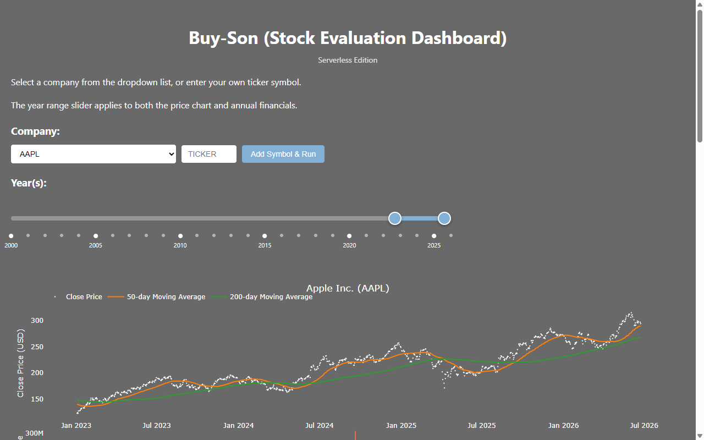

# Stock Evaluation Dashboard

A web-based stock analysis tool that displays interactive charts for any US-listed company. View price history, trading volume, 10+ years of financial statements, company details, and balance sheet breakdowns — all in one dashboard.

**Live demo:** https://stocks.jhviv.com



## What It Does

Pick a stock ticker and instantly see:

- **Price chart** with 50-day and 200-day moving averages
- **Volume chart** with up/down day coloring
- **Financial timeline** showing 10+ years of revenue, expenses, and net income (from SEC filings)
- **Company info** including sector, P/E ratios, and business summary
- **Balance sheet** visualized as bar charts and sunburst diagrams

Data comes from Yahoo Finance (prices, company info) and SEC EDGAR (historical financials). No API keys required.

## Prerequisites

See [PREREQUISITES.md](PREREQUISITES.md) for the full list. In short: Python 3.11+, Node.js 18+, AWS CLI, Docker, and an AWS account.

## Quick Start

```bash
git clone <repo-url>
cd stock-eval-dashboard

python -m venv .venv
source .venv/bin/activate        # Windows: .venv\Scripts\activate

pip install -e ".[dev,cdk]"
cd infra/cdk && pip install -r requirements.txt && cd ../..

cd infra/cdk && cdk bootstrap && cd ../..
cd infra/cdk && cdk deploy --all --require-approval never && cd ../..

python scripts/seed_tickers.py
```

The deploy output shows your dashboard URL. For detailed instructions and troubleshooting, see [DEPLOYMENT.md](DEPLOYMENT.md).

## Usage

1. Open the dashboard URL in a browser
2. Select a ticker from the dropdown (20 pre-loaded) or add a new one
3. Switch between chart tabs: Price, Volume, Financials, Info, Balance Sheet
4. Adjust the year range to zoom in on specific periods

Data loads on-demand from Yahoo Finance and SEC EDGAR — first load takes a few seconds due to Lambda cold starts.

## Local Testing

Run the dashboard locally without deploying to AWS:

```bash
make local-api
```

Open http://localhost:3000. The local server uses in-memory storage (no DynamoDB) and fetches live data from Yahoo Finance and SEC EDGAR.

## Running Tests

```bash
make lint    # ruff + mypy
make test    # pytest with coverage
```

## Architecture

```
Route 53 → CloudFront → S3 (static frontend)
CloudFront → API Gateway → Lambda → yfinance / SEC EDGAR / DynamoDB
```

Three CDK stacks deploy the entire application. Runs within the AWS free tier (~$0/month).

For full details, see [docs/ARCHITECTURE.md](docs/ARCHITECTURE.md).

## Documentation

- [Prerequisites](PREREQUISITES.md) — what you need before deploying
- [Deployment Guide](DEPLOYMENT.md) — step-by-step deploy instructions
- [Architecture](docs/ARCHITECTURE.md) — system design and component details
- [Changelog](CHANGELOG.md) — release history

## Cost

Designed to run within the AWS free tier. At typical personal usage levels (under 1,000 requests/month), the monthly cost is effectively $0.

## License

MIT
